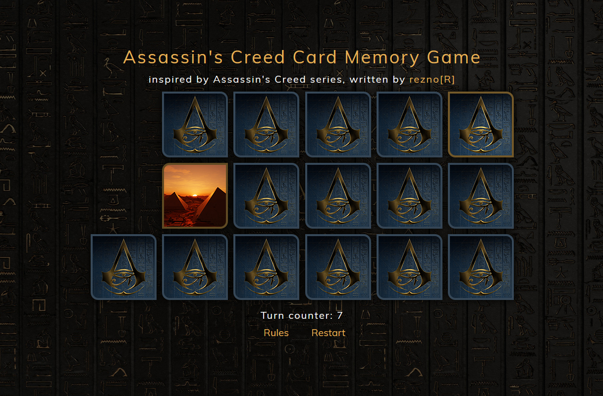

# HTML/CSS/JavaScript - Assassin's Creed Card Memory Game
> A simple card memory game inspired by my brother, Pasja Informatyki and Assassin's Creed game series. Link to live version: [Link](https://reznor.tech/projects/ac-card-memory-game/game.html)

## Table of contents
* [General info](#general-info)
* [Screenshots](#screenshots)
* [Technologies](#technologies)
* [Features](#features)
* [Inspiration](#inspiration)
* [Contact](#contact)

## General info
This little game I've created as a small birthday gift to my brother, who likes Assassin's Creed game series. It's written in HTML/CSS/JavaScript and uses jQuery, media queries for mobile devices. The custom screenshots for the cards are made by me. The original project is based on the idea present in the JavaScript course from Pasja Informatyki ( [Link](https://www.youtube.com/watch?v=edNqTubHUU0) ) however I improved it's look, added transition effects, and rewritten the code to include more features, get rid of bugs, and be less redundant. Features random array shuffling using the Fisher-Yates algorithm in pure JavaScript - [Link](https://bost.ocks.org/mike/shuffle/). Runs even on IE11.

## Screenshots
 

## Technologies
* HTML5
* CSS
* JavaScript
* jQuery 3.4.1
* html5shiv 3.7.3
* Google Fonts (Muli)

## Features
* Board of 18 cards (9 pairs)
* Card images for pairs are randomly choosen each restart from a base of 34 total (it's easy to add more)
* Random array shuffling using the Fisher-Yates algorithm in pure JavaScript
* Custom graphics (includes my own screenshots)
* Card mouse hover effects
* Card clicking animations
* Turn counter
* Rules/Restart buttons
* Winning message shows the total turn count it took for the player
* Built-in check prevents user from uncovering more than 2 cards at once
* Built-in check prevents user from clicking the same card twice
* Auto-generated inner HTML for divs and Event Listeners
* Uses media queries for mobile devices (1080px width and less)

To-do list:
* ~~Center the game in the browser window~~
* ~~Make it more mobile-friendly~~
* ~~Auto-generate the card divs in HTML~~
* Add a scoreboard
* Add a timer
* Add nick entry
* Add difficulty levels? (more pairs)
* ~~Delay transition animation for the card images~~
* recreate the page instead of reloading

## Inspiration
Project inspired by my brother, Pasja Informatyki, based on the Assassin's Creed game series by Ubisoft. All trademarks and art are part of Ubisoft.

## Contact
Written by [ReznoRMichael](https://github.com/ReznoRMichael) 